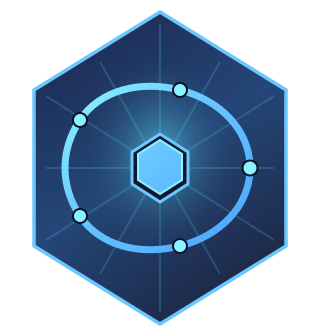

<p align="center">
  
</p>

# FlowStone

[](https://github.com/nshkrdotcom/flowstone/actions/workflows/ci.yml)
[](https://hex.pm/packages/flowstone)
[](https://hexdocs.pm/flowstone)
[](https://github.com/nshkrdotcom/flowstone/blob/main/LICENSE)

**Asset-first orchestration for the BEAM.**

FlowStone is a data orchestration framework for Elixir that treats data artifacts (assets) as first-class citizens. Inspired by [Dagster](https://dagster.io/), but built to leverage BEAM's fault tolerance, real-time capabilities, and operational simplicity.

## Why FlowStone?

Traditional workflow orchestration is task-centric: define steps, execute in order, hope nothing breaks. This leads to:

- Implicit data contracts between steps
- Difficult lineage tracking ("where did this data come from?")
- Non-reproducible results
- Painful debugging

**FlowStone inverts this model.** You define *assets* (data artifacts), and the execution graph is derived from their dependencies. Every materialization is tracked, lineage is automatic, and you can answer "what happens if this source changes?" with a single query.

## Quick Example

```elixir
defmodule MyApp.Pipeline do
  use FlowStone.Pipeline

  asset :raw_events do
    description "Raw events from source systems"
    io_manager :s3
    bucket "data-lake"
    partitioned_by :date

    execute fn context, _deps ->
      fetch_events_for_date(context.partition)
    end
  end

  asset :cleaned_events do
    description "Validated and cleaned events"
    depends_on [:raw_events]
    io_manager :postgres
    table "analytics.cleaned_events"

    execute fn context, %{raw_events: events} ->
      {:ok, clean_and_validate(events)}
    end
  end

  asset :daily_report do
    description "Aggregated daily metrics"
    depends_on [:cleaned_events]
    io_manager :s3
    path fn partition -> "reports/#{partition}.json" end

    execute fn context, %{cleaned_events: events} ->
      {:ok, aggregate_metrics(events)}
    end
  end
end

# Materialize an asset
FlowStone.materialize(:daily_report, partition: ~D[2025-01-15])

# Materialize with all dependencies
FlowStone.materialize_all(:daily_report, partition: ~D[2025-01-15])

# Backfill historical data
FlowStone.backfill(:daily_report,
  partitions: Date.range(~D[2024-01-01], ~D[2024-12-31]),
  max_parallel: 10
)

# Query lineage
FlowStone.Lineage.upstream(:daily_report, ~D[2025-01-15])
# => [{:cleaned_events, ~D[2025-01-15]}, {:raw_events, ~D[2025-01-15]}]
```

## Key Features

### Asset-First Architecture
- **Explicit Dependencies**: Assets declare what they depend on
- **Automatic DAG Construction**: Execution order derived from dependencies
- **Compile-Time Validation**: Catch errors before runtime

### Materialization Tracking
- **Every Execution Recorded**: Who ran what, when, with what inputs
- **Lineage Queries**: Trace any output back to its sources
- **Impact Analysis**: Know what breaks before making changes

### Partitioning & Multi-Tenancy
- **Time-Based Partitions**: Daily, hourly, or custom time windows
- **Custom Partitions**: Tenant, region, or any composite key
- **Row-Level Security**: Built-in tenant isolation

### Human-in-the-Loop
- **Checkpoint Gates**: Pause workflows for approval
- **Configurable Timeouts**: Escalation and auto-decision
- **Full Audit Trail**: Who approved what and why

### Real-Time UI
- **LiveView Dashboard**: WebSocket-powered, no polling
- **Asset Graph Visualization**: Interactive DAG explorer
- **Approval Queue**: Review and approve pending checkpoints

### Integrations
- **I/O Managers**: PostgreSQL, S3, Parquet, custom
- **LLM Support**: Rate-limited API calls with retry
- **Python/ML**: Erlport integration for ML pipelines
- **dbt**: Run dbt models as FlowStone assets

## Installation

Add to your `mix.exs`:

```elixir
def deps do
  [
    {:flowstone, "~> 0.2.0"}
  ]
end
```

## Documentation

### Architecture Decision Records

The `/docs/adr/` directory contains comprehensive ADRs documenting every design decision:

| ADR | Topic |
|-----|-------|
| [0001](docs/adr/0001-asset-first-orchestration.md) | Asset-first architecture |
| [0002](docs/adr/0002-dag-engine-persistence.md) | DAG engine and persistence |
| [0003](docs/adr/0003-partitioning-isolation.md) | Partitioning and tenant isolation |
| [0004](docs/adr/0004-io-manager-abstraction.md) | I/O manager abstraction |
| [0005](docs/adr/0005-checkpoint-approval-gates.md) | Checkpoint and approval gates |
| [0006](docs/adr/0006-oban-job-execution.md) | Oban job execution |
| [0007](docs/adr/0007-scheduling-sensors.md) | Scheduling and sensors |
| [0008](docs/adr/0008-resource-injection.md) | Resource injection |
| [0009](docs/adr/0009-error-handling.md) | Error handling |
| [0010](docs/adr/0010-elixir-dsl-not-yaml.md) | Elixir DSL (not YAML) |
| [0011](docs/adr/0011-observability-telemetry.md) | Observability and telemetry |
| [0012](docs/adr/0012-liveview-ui.md) | LiveView UI |
| [0013](docs/adr/0013-testing-strategies.md) | Testing strategies |
| [0014](docs/adr/0014-lineage-reporting.md) | Lineage and audit reporting |
| [0015](docs/adr/0015-external-integrations.md) | External integrations |

## Comparison

### vs. Dagster

| Feature | Dagster | FlowStone |
|---------|---------|-----------|
| Language | Python | Elixir |
| Asset-first | Yes | Yes |
| Lineage | Yes | Yes |
| Real-time UI | Polling (React) | Push (LiveView) |
| Fault tolerance | Process-based | OTP supervision |
| Hot code reload | Restart required | Zero-downtime |
| Memory footprint | ~1.2GB+ | ~300MB |
| Integrations | 100+ | ~15 (growing) |

### vs. Oban

| Feature | Oban | FlowStone |
|---------|------|-----------|
| Job queue | Yes | Uses Oban |
| Asset-first | No | Yes |
| Lineage | No | Yes |
| Partitioning | No | Yes |
| DAG execution | No | Yes |
| Checkpoints | No | Yes |

FlowStone uses Oban for job execution but adds the asset-first layer on top.

## Philosophy

1. **Assets, not tasks**: Define what data you want, not how to compute it
2. **BEAM-native**: Leverage OTP for fault tolerance, LiveView for UI
3. **Explicit over implicit**: Dependencies, resources, and context are always explicit
4. **Compile-time safety**: Catch configuration errors before runtime
5. **Testable by design**: Every component can be tested in isolation

## Status

FlowStone is in **active development** with core functionality implemented:

### Implemented
- Asset DSL and Pipeline definitions
- DAG construction from dependencies
- Materialization execution with Oban job queue
- In-memory and PostgreSQL I/O managers
- Partition serialization with proper round-trip
- Lineage tracking (in-memory and database)
- Checkpoint/approval system
- Materialization metadata persistence
- Telemetry and structured error handling

### Execution Model
- **Synchronous**: When Oban is not running, `materialize/2` executes synchronously
- **Asynchronous**: When Oban is running, `materialize/2` enqueues a job and returns `{:ok, %Oban.Job{}}`
- Jobs persist runtime configuration via `FlowStone.RunConfig` for cross-restart resilience

## Contributing

Contributions welcome! Please read the ADRs first to understand the design philosophy.

## License

MIT
